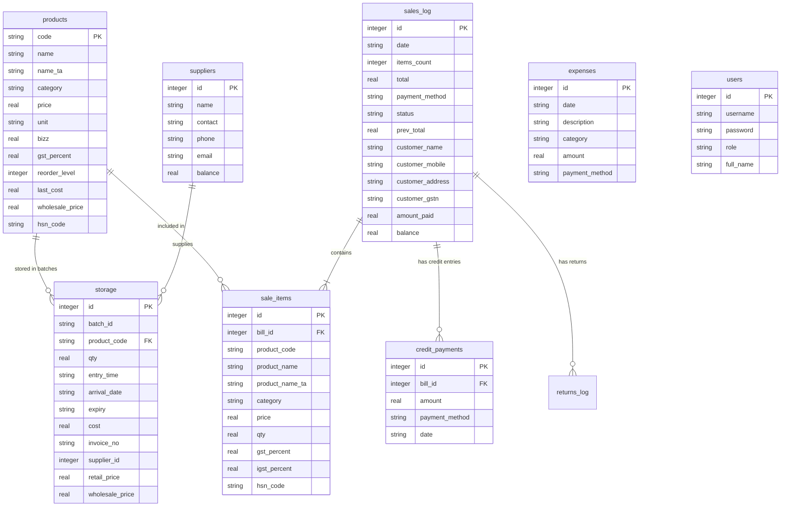
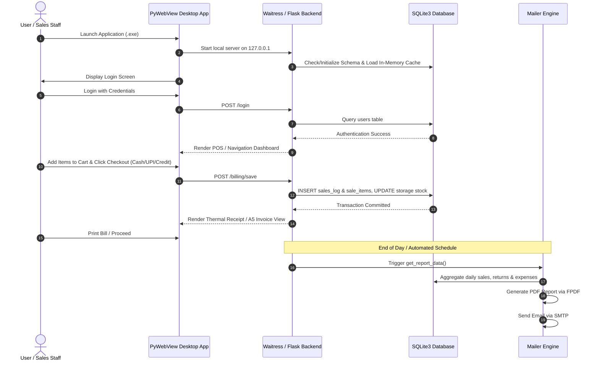

# INTERNSHIP PROJECT REPORT & DOCUMENTATION
## JAI AGENCY — Sales, Billing, Inventory & Accounts Management System

---

## 1. Project Information & Metadata

- **Project Title:** Jai Agency — Enterprise Sales, Billing, Inventory & Accounts Management System
- **Domain:** Enterprise Software / Retail & Wholesale ERP / Desktop Web Application
- **Role / Internship:** Full-Stack Software Engineering Intern
- **Target Organization:** Jai Agency (Commercial Distribution & Retail Firm)
- **Technology Stack:** Python, Flask, SQLite3, Waitress WSGI, PyWebView, HTML5, Vanilla CSS3, JavaScript (ES6+), FPDF, PyInstaller

---

## 2. Executive Summary

**Jai Agency Management System** is an end-to-end Enterprise Resource Planning (ERP) and Point of Sale (POS) desktop application designed for commercial distribution agencies, wholesalers, and retail stores. 

The software streamlines the complete operational workflow of an agency—including batch-wise stock control, real-time POS billing, multi-lingual invoicing (English & Tamil), GST/IGST calculations, customer & supplier credit ledgers, expense tracking, PIN-protected profit analytics, and automated daily PDF email reporting. Built as a self-contained Python application, it runs locally as a native Windows desktop executable via PyWebView and Waitress WSGI server with SQLite database persistence.

---

## 3. Problem Statement & Project Objectives

### 3.1 Problem Statement
Traditional retail and wholesale agency operations face several critical challenges:
1. **Manual Billing Bottlenecks:** Manual paper invoicing leads to errors in GST calculations, slow checkout times, and missing transaction records.
2. **Stock Discrepancies:** Inability to track batch numbers, expiry dates, lot arrival times, and reorder levels leads to stock loss and expired products.
3. **Credit & Payment Tracking:** Difficulty in tracking pending customer credit balances, partial payments, and supplier payables.
4. **Lack of Automated Business Insights:** Difficulty in generating daily sales summaries, profit margin analyses, and automated management reports.

### 3.2 Key Objectives
- **Automate POS & Invoicing:** Provide rapid barcode/code-based item lookup with support for Thermal Receipts (80mm) and A5 Standard Tax Invoices.
- **Multi-lingual Support:** Support regional language billing (Tamil & English product naming) for local staff and customers.
- **Batch & Inventory Management:** Enable FIFO/Batch-wise stock entry, warehouse transfer logging, reorder alerts, and supplier tracking.
- **Financial Controls & Ledgers:** Maintain complete customer credit ledgers, supplier balance sheets, categorized expense records, and PIN-secured profit reports.
- **Automated Reporting & Backup:** Automatically generate daily PDF sales summaries and dispatch them to management via SMTP email.
- **Offline-First Desktop Delivery:** Package the entire web app into a single, offline Windows executable (`.exe`) requiring zero server installation.

---

## 4. System Architecture & Tech Stack

```
+-------------------------------------------------------------------+
|                     Native Windows Application                     |
|                                                                   |
|   +-----------------------------------------------------------+   |
|   |             PyWebView Native Window Interface             |   |
|   +-----------------------------------------------------------+   |
|                                 |                                 |
|                                 v                                 |
|   +-----------------------------------------------------------+   |
|   |         Frontend (HTML5, Custom CSS3, JS, Jinja2)          |   |
|   | - POS Interface      - A5 Invoice Engine                  |   |
|   | - Live Stock Grid    - Thermal Receipt Printer View       |   |
|   | - Financial Ledgers  - Analytics & Reports                |   |
|   +-----------------------------------------------------------+   |
|                                 |                                 |
|                                 v (HTTP / WSGI)                   |
|   +-----------------------------------------------------------+   |
|   |          Waitress Production WSGI Web Server              |   |
|   +-----------------------------------------------------------+   |
|                                 |                                 |
|                                 v                                 |
|   +-----------------------------------------------------------+   |
|   |                   Flask Core Backend Framework             |   |
|   |  (Routing, Session Management, Business Logic, POS Engine)|   |
|   +-----------------------------------------------------------+   |
|          |                      |                       |         |
|          v                      v                       v         |
|   +--------------+      +----------------+      +--------------+  |
|   | SQLite3 DB   |      | Automated Mailer|      | PyInstaller  |  |
|   | (WAL Mode)   |      | (FPDF + SMTP)  |      | Packaging    |  |
|   +--------------+      +----------------+      +--------------+  |
+-------------------------------------------------------------------+
```

### 4.1 Technology Stack Details

| Component | Technology | Purpose |
| :--- | :--- | :--- |
| **Backend Framework** | Python 3.x / Flask | Web server routing, REST API controllers, session & security management. |
| **Production WSGI Server** | Waitress | Multi-threaded production server hosting Flask locally without external dependencies. |
| **Desktop Window Wrapper** | PyWebView | Renders the web interface as a native Windows desktop GUI application. |
| **Database Engine** | SQLite3 (WAL Mode) | Zero-configuration relational database stored securely in `%ProgramData%\jai agency\JAI_AGENCY.db`. |
| **Frontend UI** | HTML5, Vanilla CSS3 | Responsive layouts, modern dark/light styling, glassmorphism UI components. |
| **Templating Engine** | Jinja2 | Dynamic HTML rendering for POS, invoices, ledgers, and reports. |
| **PDF Generation** | FPDF | Programmatic daily sales summary PDF report creation. |
| **Email Automation** | Python `smtplib` & `email` | Automated end-of-day email delivery of PDF financial summaries to agency owners. |
| **Executable Packaging** | PyInstaller | Compiles Python script, templates, static files, and database into standalone Windows `.exe`. |

---

## 5. Core System Modules & Features

```mermaid
graph TD
    App[Jai Agency Core System] --> POS[Point of Sale & Billing]
    App --> Inv[Inventory & Stock Control]
    App --> Fin[Financials & Ledgers]
    App --> Rep[Reports & PDF Mailer]
    App --> Admin[Database & System Admin]

    POS --> POS1[Retail & Wholesale Billing]
    POS --> POS2[Thermal & A5 Invoices]
    POS --> POS3[Multi-Payment: Cash, UPI, Credit]
    POS --> POS4[Returns & Bill Corrections]

    Inv --> Inv1[Batch / Lot Tracking]
    Inv --> Inv2[Expiry & Low Stock Alerts]
    Inv --> Inv3[Supplier Purchases]
    Inv --> Inv4[Stock Transfers & Adjustments]

    Fin --> Fin1[Customer Credit Ledgers]
    Fin --> Fin2[Supplier Credit Balances]
    Fin --> Fin3[Expense Categorization]
    Fin --> Fin4[PIN-Protected Profit Reports]

    Rep --> Rep1[Daily Sales Summaries]
    Rep --> Rep2[Automated PDF Email Reports]
    Rep --> Rep3[Payment-wise Breakdown]

    Admin --> Admin1[Role-Based Access: Admin/Sales/Inventory]
    Admin --> Admin2[In-App SQL Data Manager]
    Admin --> Admin3[Automated Data Migrations]
```



### 5.1 Point of Sale (POS) & Invoicing Engine
- **Dual Sales Modes:** Toggle between Retail and Wholesale pricing structures seamlessly.
- **Fast Product Search:** Instant search by product code, English name, Tamil name (`name_ta`), or category.
- **Tax Breakdown Engine:** Automatic computation of GST (%) and IGST (%) per item with HSN code tagging.
- **Flexible Payments:** Split and accept payments via **Cash**, **UPI / Online**, **Credit**, and **Compliment**.
- **Dual Document Printing:** 
  - **Thermal Receipt (80mm):** Compact POS receipt layout for fast customer checkout.
  - **Standard A5 Invoice:** Detailed commercial tax invoice with buyer/seller GSTIN details, signature block, and payment status.
- **Returns & Corrections:** Process customer sales returns, item exchanges, and bill corrections with automated inventory restock.

### 5.2 Inventory & Warehouse Management
- **Batch & Lot Tracking:** Maintain distinct batches (`batch_id`) with arrival dates, expiry dates, purchase costs, and stock quantities.
- **Stock Movements & Transfers:** Log stock transfers between storage locations or branches with auditing.
- **Reorder Level Monitoring:** Automatic alert triggers when product quantity drops below defined thresholds.
- **Supplier Purchase Entry:** Direct purchase invoice logging linked to supplier accounts.

### 5.3 Accounts, Ledgers & Expenses
- **Customer Credit Ledger:** Track customer outstanding balances, credit payment logs (`credit_payments`), and payment history.
- **Supplier Balance Management:** Monitor supplier accounts payable and log payment clearing.
- **Expense Tracker:** Log daily operational expenses with custom categories (rent, tea, electricity, fuel, maintenance) and payment channels.
- **PIN-Protected Profit Analytics:** Secure access to profit margins, cost analysis, and net earnings requiring master administrative authentication.

### 5.4 Automated Daily E-Mail Reporting (`mailer.py`)
- End-of-day trigger extracts active sales log, returns, cash/UPI breakdown, credit receipts, and expenses.
- Generates a polished PDF summary report using `FPDF`.
- Automatically sends the PDF as an email attachment via SMTP to agency management.

### 5.5 System Administration & Data Safety (`admin_db.html`)
- Built-in **In-App Data Manager** allowing administrators to view, search, edit, or delete database rows without installing external SQLite management tools.
- Role-based user authentication system with default roles: **Admin**, **Sales Executive**, and **Inventory Manager**.
- Automatic schema verification (`init_db_if_missing`) and database migration routines (`run_migrations`).

---

## 6. Database Schema & Architecture

The database is built on SQLite3 and configured with Write-Ahead Logging (`PRAGMA journal_mode=WAL`) for high concurrent read/write efficiency.



---

## 7. Operational & Execution Flow



---

## 8. Key Implementation Highlights & Technical Contributions

1. **Hybrid Web-Desktop Infrastructure:** Designed an architecture combining Flask's agile web development model with PyWebView and Waitress server to deliver an offline desktop software package executable without cloud server cost.
2. **Dynamic In-Memory Caching & Real-Time Sync:** Implemented in-memory data structures (`PRODUCTS`, `STORAGE`, `SALES_LOG`) backed by WAL-mode SQLite database queries to guarantee instant GUI responsiveness during peak billing hours.
3. **Resilient Data Storage Location:** System automatically targets `%ProgramData%\jai agency\JAI_AGENCY.db` for persistent multi-user Windows access, with safe fallback to local application directory.
4. **GST Tax & Regional Language Integration:** Engineered bilingual invoice rendering logic (English & Tamil) with accurate HSN-level tax splits (CGST + SGST or IGST).
5. **In-App Administrative Tools:** Developed custom SQL browser UI (`admin_db.html`) directly inside Flask, eliminating administrative dependency on external SQLite tools.

---

## 9. Verification & Testing

- **Functional Testing:** Verified end-to-end checkout workflows for Cash, UPI, Credit, and Compliment billing types.
- **Invoice & Thermal Print Verification:** Tested thermal receipt printing on 80mm POS printers and standard A5 paper tax invoice layout.
- **Stock Audit Verification:** Validated stock deduction upon sale creation, stock restoration upon sale cancellation/return, and supplier purchase batch additions.
- **Database Integrity & Concurrent Writes:** Executed database stress verification ensuring zero lock failures under WAL mode.
- **Packaging & Executable Testing:** Built standalone single-file Windows executable via PyInstaller (`build_final.bat`) and verified startup speed and asset loading.

---

## 10. Conclusion & Future Roadmap

### 10.1 Conclusion
The **Jai Agency Management System** successfully addresses the real-world operational needs of commercial distributors and retailers. By combining POS automation, multi-language support, inventory batch tracking, customer credit ledgers, expense logging, and automated PDF email reporting into a single offline Windows application, the project delivers substantial productivity improvements, eliminates billing errors, and empowers business owners with real-time financial visibility.

### 10.2 Future Roadmap
- **Cloud Database Synchronization:** Optional cloud sync (Firebase/PostgreSQL) to sync sales across multiple branches.
- **WhatsApp API Integration:** Automated bill delivery directly to customer phone numbers via WhatsApp Web API.
- **Barcode Printing:** Built-in barcode label designer and barcode sticker printer integration.
